# Fundamentos de Git

## Por que estudar Git (mais uma vez)?

- Ciclo de vida do DevOps é cada vez mais atrelado a um fluxo Git;
- Perpassa desde o **gerenciamento de projeto** até o **deploy**;
* Fácil utilizar **sem saber direito** o que está fazendo:
  - Principalmente quando se trata de *branching*.

Portanto, uma revisão sempre faz bem.

## Sobre Sistemas de Controle de Versão

- *Version Control Systems* (VCS) são sistemas que registram alterações em um ou mais arquivos durante o tempo:
  - Permitem o retorno a versões específicas.

* 3 tipos:
  1) Local;
  2) Centralizado;
  3) Distribuído.

## VCS Local

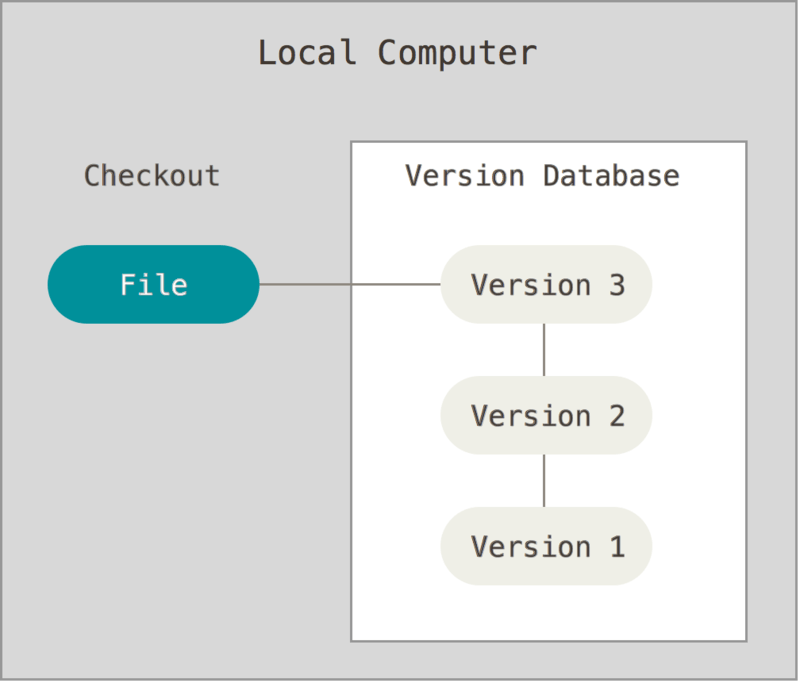

## VCS Centralizado


## VCS Distribuído { .scrollable }


## História

- Linux Open source project;
- 2005: problemas com BitKepper:
  - Sistema proprietário distribuído de VCS;
  - Deixou de ser gratuito para o projeto;
- Equipe do projeto desenvolveu seu próprio VCS distribuído, o **Git**.

## História (cont.)

- Principais objetivos:
  - Velocidade;
  - Design simplificado;
  - Suporte robusto a um desenvolvimento não linear (vários branches paralelos);
  - Completamente distribuído;
  - Capacidade de trabalhar eficientemente com projetos grandes.

## Git

Um sistema de controle de versão completamente distribuído.

## Snapshots ao invés de Diferenças (deltas)


## Snapshots ao invés de Diferenças (deltas)


## Outras características

* Toda (ou quase toda) operação é local:
  - Sem necessidade de consulta a um servidor central, por exemplo;
  - Cada clone é uma cópia de todo o histórico do projeto;
  - Nenhum trabalho offline é impedido;

## Outras características (cont.)

- Mantém integridade;
  - Tudo é *checksummed* e referenciado pelo seu checksum (SHA-1);
  - Checagem de integridade é feita a cada operação;
- Geralmente, operações apenas adicionam dados:
  - A perda de informação  por erro (depois de um commit) é raríssima;

## Os 3 estados

1) **Modified**: um arquivo foi alterado, mas não foi realizado seu *commit*;
2) **Staged**: arquivo marcado para ter sua versão **atual** no próximo *commit*;
3) **Committed**: dados estão armazenados na base de dados do repositório.

## Transições entre os 3 estados

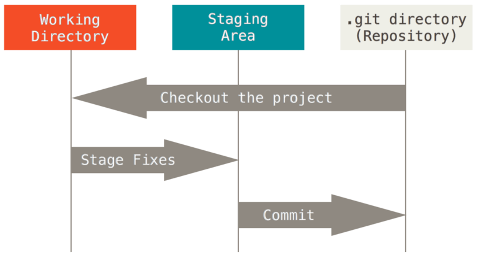

*Staging area* == *Index*

## Transições entre os 3 estados

- Fluxo de trabalho básico:
  1) Modifica arquivos no diretório de trabalho;
  2) Seleciona apenas as alterações que deseja que estejam no próximo commit e adiciona **apenas** essas na *staging area*;
  3) Realiza o commit, o que salva os arquivos na *staging area* no diretório git.

## Transições entre os 3 estados (cont.)

- Se um arquivo está no diretório `.git`, então é considerado **committed**;
- Se ele foi alterado e adicionado à *staging area*, então está **staged**;
- Se altera um arquivo após seu *check out* e ainda não foi para *staged area*, então é apenas **modified**.

## Instalando o git

Ainda não tem instalado?? :)

[https://git-scm.com/book/en/v2/Getting-Started-Installing-Git](https://git-scm.com/book/en/v2/Getting-Started-Installing-Git)

## Configurações iniciais

`git config` para alterar configurações

- 3 arquivos, ou locais, importantes:
  - `/etc/gitconfig` configurações *system wide* `git config --system`;
  - `~/.gitconfig` ou `~/.config/git/config` configurações de usuário `git config --global`;
  - `.git/config` configurações de projeto `git config --local`;

Caminhos e configurações no windows: [https://git-scm.com/book/en/v2/Getting-Started-First-Time-Git-Setup](https://git-scm.com/book/en/v2/Getting-Started-First-Time-Git-Setup)

## Exemplo de configurações

```sh
git config --list --show-origin
git config --global user.name "John Doe"
git config --global user.email johndoe@example.com]
```

```sh
git config --global core.editor vim
```

```sh
git config --global init.defaultBranch main
```
* Desde 2020, o nome da branch default passou de `master` para `main`.

[https://sfconservancy.org/news/2020/jun/23/gitbranchname/](https://sfconservancy.org/news/2020/jun/23/gitbranchname/)

## Read the manual[.](https://en.wikipedia.org/wiki/RTFM)

```sh
git help
```

# Git Básico

## Iniciando um repositório

```sh
cd meu_projeto
git init
```

```sh
git clone https://github.com/libgit2/libgit2
```

Investigue o diretório `.git` criado.

## Ciclo de vida

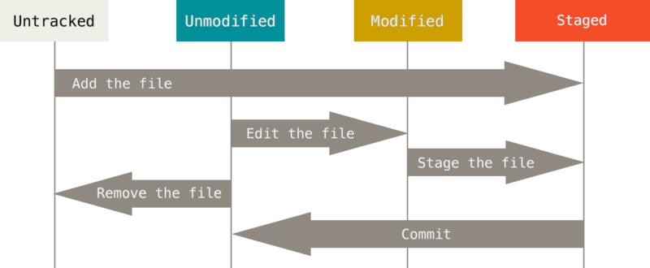

## Checando o status

```sh
$ git status
On branch master
Your branch is up-to-date with 'origin/master'.
nothing to commit, working tree clean
```

```sh
$ echo 'My Project' > README
$ git status
On branch master
Your branch is up-to-date with 'origin/master'.
Untracked files:
  (use "git add <file>..." to include in what will be committed)

    README

nothing added to commit but untracked files present (use "git add" to track)
```

## Rastreando novos arquivos

```bash
$ git add README
```

```bash
$ git status
On branch master
Your branch is up-to-date with 'origin/master'.
Changes to be committed:
  (use "git restore --staged <file>..." to unstage)

    new file:   README
```

## *Staging* arquivos modificados

Após modificar um arquivo *tracked*:

```bash
$ git status
On branch master
Your branch is up-to-date with 'origin/master'.
Changes to be committed:
  (use "git reset HEAD <file>..." to unstage)

    new file:   README

Changes not staged for commit:
  (use "git add <file>..." to update what will be committed)
  (use "git checkout -- <file>..." to discard changes in working directory)

    modified:   CONTRIBUTING.md
```

## *Staging* arquivos modificados (cont.)

```sh
$ git add CONTRIBUTING.md
$ git status
On branch master
Your branch is up-to-date with 'origin/master'.
Changes to be committed:
  (use "git reset HEAD <file>..." to unstage)

    new file:   README
    modified:   CONTRIBUTING.md
```

## Pergunta

O que acontece se alterarmos um arquivo *staged* ?

. . .

Aparece em **committed** e **not staged**.

Apenas a alteração que foi **staged** é que será adicionada ao commit.

## Status curto

```bash
$ git status -s
 M README
MM Rakefile
A  lib/git.rb
M  lib/simplegit.rb
?? LICENSE.txt
```

- Coluna 1: status na *staging area*;
- Coluna 2: status na *working tree*;

## Ignorando arquivos

- Arquivo `.gitignore`;
- Muito importante para evitar arquivos temporários ou de conteúdo sensível.

```bash
# ignore all .a files
*.a

# but do track lib.a, even though you're ignoring .a files above
!lib.a

# only ignore the TODO file in the current directory, not subdir/TODO
/TODO

# ignore all files in any directory named build
build/

# ignore doc/notes.txt, but not doc/server/arch.txt
doc/*.txt

# ignore all .pdf files in the doc/ directory and any of its subdirectories
doc/**/*.pdf
```

## Ignorando arquivos (cont.)

É possível ter mais de um `.gitignore` em um mesmo projeto.

Exemplos de `.gitignore`: [https://github.com/github/gitignore](https://github.com/github/gitignore)

## Analisando as alterações

- Comparação entre *working tree* e não *staged*:

```bash
git diff
```

- Comparação entre *staging area* e o último `commit`:

```bash
git diff --cached
```

- Pode-se utilizar `git difftool` para visualizar diferenças em uma ferramente externa.

## Commit

- *Commit* é a definição de uma versão. Um *snapshot* da *working tree* que desejamos armazenar;

```bash
git commit
```

- Abrirá o editor de texto padrão (`core.editor`) para a definição de uma mensagem de commit;
- Lembrar: apenas o que está na `staging area`, e apenas isso, será adicionado ao *commit*.

## Mais Commit

- Quer que todas as alterações da *working tree* sejam passadas para o *commit* automaticamente?

```bash
git commit -a
```

> "-a": Grandes poderes, grandes responsabilidades

- Quer adicionar uma mensagem sem abrir o editor?

```bash
git commit -m "mensagem diretamente aqui"
```

## Removendo arquivos

```bash
git rm <file>
git rm --cached # remove apenas do repositório, mas arquivo permanece no disco
git rm -f <file> # força remoção de arquivos staged ou alterados
git rm log/\*.log # exemplo de remoção de vários arquivos
```

O que ocorre se realizarmos um `rm <file>` básico?

## Movendo arquivos

```bash
git mv file_from file_to

#ou

mv README.md README
git rm README.md
git add README
```

## Git Log

```bash
$ git clone https://github.com/schacon/simplegit-progit
$ git log
commit ca82a6dff817ec66f44342007202690a93763949
Author: Scott Chacon <schacon@gee-mail.com>
Date:   Mon Mar 17 21:52:11 2008 -0700

    Change version number

commit 085bb3bcb608e1e8451d4b2432f8ecbe6306e7e7
Author: Scott Chacon <schacon@gee-mail.com>
Date:   Sat Mar 15 16:40:33 2008 -0700

    Remove unnecessary test

commit a11bef06a3f659402fe7563abf99ad00de2209e6
Author: Scott Chacon <schacon@gee-mail.com>
Date:   Sat Mar 15 10:31:28 2008 -0700

    Initial commit
```

## Mais git log

```bash
$ git log --pretty=format:"%h %s" --graph
* 2d3acf9 Ignore errors from SIGCHLD on trap
*  5e3ee11 Merge branch 'master' of git://github.com/dustin/grit
|\
| * 420eac9 Add method for getting the current branch
* | 30e367c Timeout code and tests
* | 5a09431 Add timeout protection to grit
* | e1193f8 Support for heads with slashes in them
|/
* d6016bc Require time for xmlschema
*  11d191e Merge branch 'defunkt' into local
```

## Limitando logs

```bash
$ git log --since=2.weeks
$ git log -- path/to/file
```

## Commit Amend

```bash
$ git commit -m 'Initial commit'
$ git add forgotten_file
$ git commit --amend
```

- Substitui o último commit por um novo;
- Apenas para commits que ainda não foram `pushed` para repositórios remotos;
- Deve ser utilizado apenas para pequeníssimas alterações.

## Retirando algo da staging area

```bash
$ git add *
$ git status
On branch master
Changes to be committed:
  (use "git reset HEAD <file>..." to unstage)

    renamed:    README.md -> README
    modified:   CONTRIBUTING.md
```

```bash
$ git reset HEAD CONTRIBUTING.md
Unstaged changes after reset:
M	CONTRIBUTING.md
```

## Revertendo modificações

```bash
$ git status
Changes not staged for commit:
  (use "git add <file>..." to update what will be committed)
  (use "git checkout -- <file>..." to discard changes in working directory)

    modified:   CONTRIBUTING.md
```

```bash
$ git checkout -- CONTRIBUTING.md
```

- **Atenção**: toda e qualquer alteração ao arquivo desde a última versão *staged* ou *committed* será perdida:
  - Talvez criar um *branch* seja uma saída melhor.

## Git restore (> 2.23.0)

```bash
$ git status
On branch master
Changes to be committed:
  (use "git restore --staged <file>..." to unstage)
	modified:   CONTRIBUTING.md
	renamed:    README.md -> README
```

```bash
$ git restore --staged CONTRIBUTING.md
$ git status
On branch master
Changes to be committed:
  (use "git restore --staged <file>..." to unstage)
	renamed:    README.md -> README

Changes not staged for commit:
  (use "git add <file>..." to update what will be committed)
  (use "git restore <file>..." to discard changes in working directory)
	modified:   CONTRIBUTING.md
```

```bash
$ git restore CONTRIBUTING.md
$ git status
On branch master
Changes to be committed:
  (use "git restore --staged <file>..." to unstage)
	renamed:    README.md -> README
```

- **Atenção**: toda e qualquer alteração ao arquivo desde a última versão *staged* ou *committed* será perdida:
  - Talvez criar um *branch* seja uma saída melhor.

## Remotes

- Um **remote** é uma cópia de um repositório armazenado em outro lugar, geralmente em uma localidade acessível pela rede;

```bash
$ git clone https://github.com/schacon/ticgit
Cloning into 'ticgit'...
remote: Reusing existing pack: 1857, done.
remote: Total 1857 (delta 0), reused 0 (delta 0)
Receiving objects: 100% (1857/1857), 374.35 KiB | 268.00 KiB/s, done.
Resolving deltas: 100% (772/772), done.
Checking connectivity... done.
$ cd ticgit
$ git remote
origin
```

- O comando `git clone` configura automaticamente um remote nomeado `origin`.

## Um ou mais remotes

```bash
$ git remote -v
origin	https://github.com/schacon/ticgit (fetch)
origin	https://github.com/schacon/ticgit (push)
```

- É possível ter mais de um remote configurado para um mesmo repositório.

```bash
$ git remote -v
bakkdoor  https://github.com/bakkdoor/grit (fetch)
bakkdoor  https://github.com/bakkdoor/grit (push)
cho45     https://github.com/cho45/grit (fetch)
cho45     https://github.com/cho45/grit (push)
defunkt   https://github.com/defunkt/grit (fetch)
defunkt   https://github.com/defunkt/grit (push)
koke      git://github.com/koke/grit.git (fetch)
koke      git://github.com/koke/grit.git (push)
origin    git@github.com:mojombo/grit.git (fetch)
origin    git@github.com:mojombo/grit.git (push)
```

Isso possibilita o trabalho/contribuições em um mesmo repositório entre diferentes usuários e equipes.

## Adicionando um remote

```bash
$ git remote
origin
$ git remote add pb https://github.com/paulboone/ticgit
$ git remote -v
origin	https://github.com/schacon/ticgit (fetch)
origin	https://github.com/schacon/ticgit (push)
pb	https://github.com/paulboone/ticgit (fetch)
pb	https://github.com/paulboone/ticgit (push)
```

## Interagindo com remotes

- Baixar dados sem merge

```bash
git fetch <remote>
```

- Baixar dados com merge automático

```bash
git pull <remote>
```

- Enviar dados

```bash
git push <remote>
```

## Outras operações com remotes

```bash
$ git remote show origin
$ git remote rename pb paul
$ git remote remove paul
```

## Tagging

- Dar um nome (e uma mensagem) para um commit;
- Útil para nomear commit que representam versões específicas de um projeto.
- Podem ser **anotadas** ou **lightweight**:
  - Anotadas possuem uma mensagem específica anexada à tag.

```bash
$ git tag -a v1.4 -m "my version 1.4"
$ git tag
v0.1
v1.3
v1.4
```

```bash
$ git tag -a v1.2 9fceb02 # para um commit específico
$ git show v1.2           # mostra info sobre tag
```

## Tagging e remotes

- Assim como muitas informações em um repositório git, **tags** são, à princípio, **locais**;
- Para compartilhar tags com um remote, é necessário enviá-las com o comando `push`:

```bash
$ git push origin v1.5

# ou

$ git push origin --tags
```

## Acessando Tags

```bash
$ git checkout v2.0.0
Note: switching to 'v2.0.0'.

You are in 'detached HEAD' state. You can look around, make experimental
changes and commit them, and you can discard any commits you make in this
state without impacting any branches by performing another checkout.

If you want to create a new branch to retain commits you create, you may
do so (now or later) by using -c with the switch command. Example:

  git switch -c <new-branch-name>

Or undo this operation with:

  git switch -

Turn off this advice by setting config variable advice.detachedHead to false

HEAD is now at 99ada87... Merge pull request #89 from schacon/appendix-final
```

**Detached HEAD** ??

## Acessando Tags com uma nova Branch

```bash
$ git checkout -b version2 v2.0.0
Switched to a new branch 'version2'
```

- Dessa forma, commits realizados a partir dessa tag serão salvos e acessíveis na nova branch criada.

# Branching

## O que é Branching?

É simplesmente **um ponteiro** para um **commit específico**.

- Cada commit possui:
  - Informações sobre autor e mensagem;
  - Ponteiro para o commit anterior (**parent commit**);
  * Ponteiro para um snapshot do working tree no momento do commit.

## Exemplo de branching

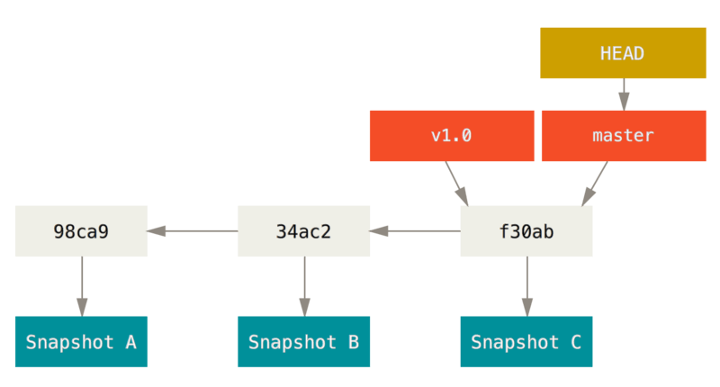

## Criação de um Branch

```bash
$ git branch testing
$ git checkout testing

# ou

$ git checkout -b testing

# ou

$ git switch -c testing
```

## Criação de um Branch (cont.)

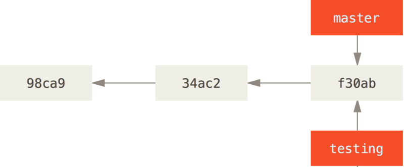

Mas qual é o branch atual?

## HEAD

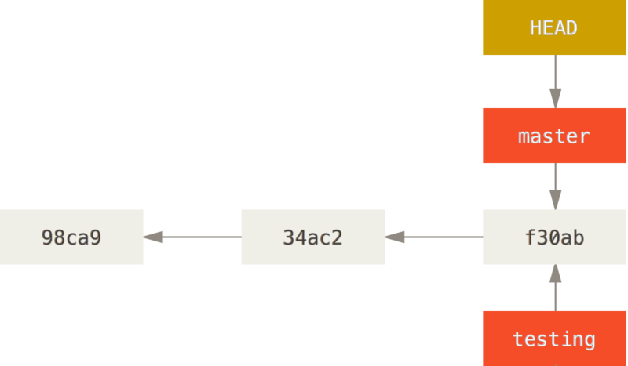

## HEAD (cont.)

```bash
$ git log --oneline --decorate
f30ab (HEAD -> master, testing) Add feature #32 - ability to add new formats to the central interface
34ac2 Fix bug #1328 - stack overflow under certain conditions
98ca9 Initial commit
```

## "Tip of a Branch"

```bash
$ vim test.rb
$ git commit -a -m 'made a change'
```

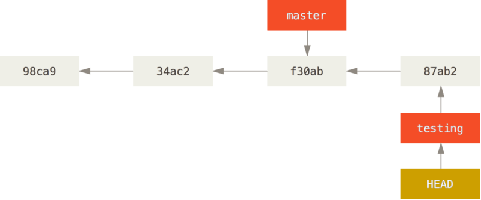

## Mudando para outra branch

```bash
$ git checkout master
# ou
$ git switch master
```

## Mudando para outra branch (cont.)

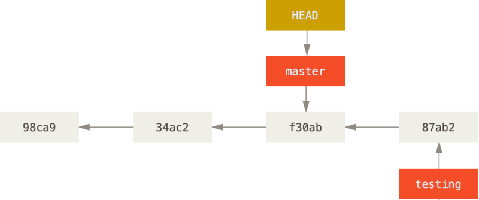

## Mudando para outra branch (cont.)

**Importante**: ao mudar de branch, os arquivos do seu *working directory* serão alterados. Se o git não conseguir fazer isso de maneira limpa/segura, a mudança de branch será impedida.

## Histórico com Divergência

```bash
$ vim test.rb
$ git commit -a -m 'made other changes'
```

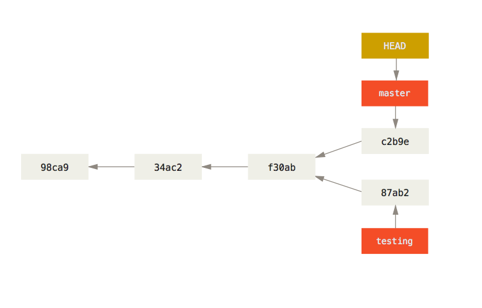

## Git log --all

```bash
$ git log --oneline --decorate --graph --all
* c2b9e (HEAD, master) Made other changes
| * 87ab2 (testing) Made a change
|/
* f30ab Add feature #32 - ability to add new formats to the central interface
* 34ac2 Fix bug #1328 - stack overflow under certain conditions
* 98ca9 initial commit of my project
```

## Exercício

Crie um repositório git e faça alguns commits e branches de forma a que o histórico reproduza a figura abaixo:

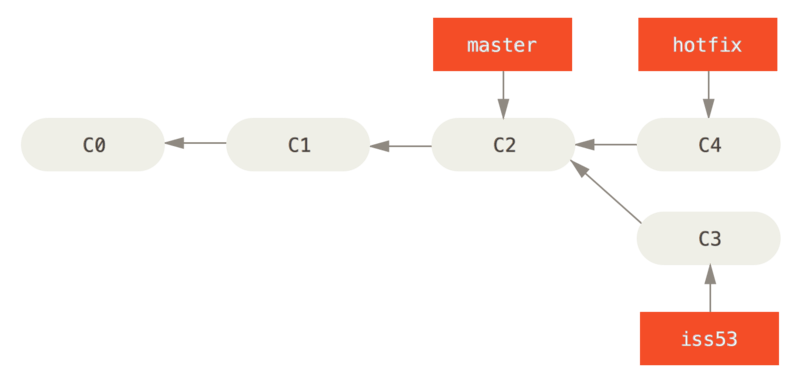

## Merge básico

```bash
$ git checkout master
$ git merge hotfix
Updating f42c576..3a0874c
Fast-forward
 index.html | 2 ++
 1 file changed, 2 insertions(+)
```

**Fast-forward** ??

## Merge básico

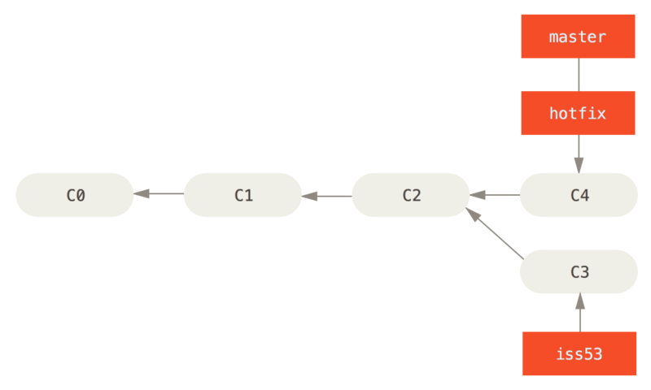

## Removendo branch

```bash
$ git branch -d hotfix
Deleted branch hotfix (3a0874c).
```

Considerando que uma branch é apenas um ponteiro, então, uma vez realizado o **merge**, podemos remover a branch anterior sem prejuízo ao histórico do projeto.

## Merge entre branches divergentes

```bash
$ git checkout iss53
Switched to branch "iss53"
$ vim index.html
$ git commit -a -m 'Finish the new footer [issue 53]'
[iss53 ad82d7a] Finish the new footer [issue 53]
1 file changed, 1 insertion(+)
```

Alterações em `hotfix` não estão em `iss53`. E se fossem necessárias para `iss53`?

. . .

Integração agora (`master->iss53`) ou depois (`iss53->master`)?

## Merging iss53 e master

```bash
$ git checkout master
Switched to branch 'master'
$ git merge iss53
Merge made by the 'recursive' strategy.
index.html |    1 +
1 file changed, 1 insertion(+)
```

## Merging iss53 e master

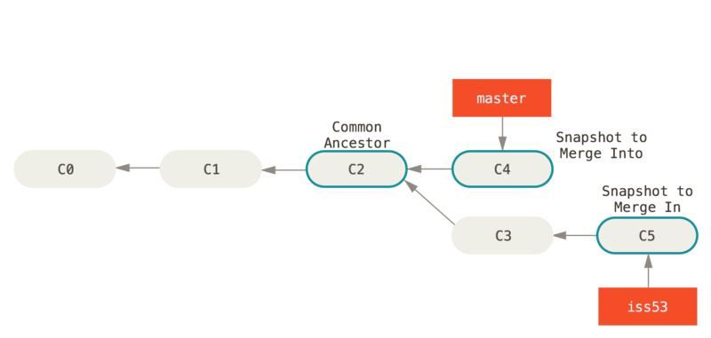

**Three-way merging**. 

## Merge commit

Commit especial que possui dois ou mais antecessores (*parent commits*).

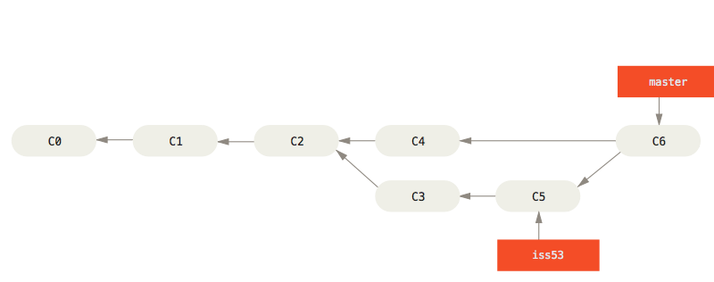

*"Fast-forward merging"* não cria um *merge commit*.

## Conflitos

- Por vezes, duas branches alteram arquivos em comum e o git não é capaz de realizar o merge das alterações de maneira automática;
* Nesse caso, o merge é **interrompido** e informa um **conflito** que deve ser resolvido manualmente.

```bash
$ git merge iss53
Auto-merging index.html
CONFLICT (content): Merge conflict in index.html
Automatic merge failed; fix conflicts and then commit the result.
```

## Informações sobre um conflito

```bash
$ git status
On branch master
You have unmerged paths.
  (fix conflicts and run "git commit")

Unmerged paths:
  (use "git add <file>..." to mark resolution)

    both modified:      index.html

no changes added to commit (use "git add" and/or "git commit -a")
```

## Aparência de um conflito

```bash
<<<<<<< HEAD:index.html
<div id="footer">contact : email.support@github.com</div>
=======
<div id="footer">
 please contact us at support@github.com
</div>
>>>>>>> iss53:index.html
```

## Resolvendo um conflito

```bash
$ git add index.html
$ git commit         # cria o merge commit e encerra o conflito
```

`git mergetool` pode ser executado para utilizar ferramentas mais robustas na resolução de conflitos.

## Comandos interessantes

```bash
$ git branch             # lista todos os branches atuais
$ git branch -v          # lista com mais detalhes
$ git branch --merged    # lista branches atualmente merged's na branch atual
$ git branch --no-merged # lista branches atualmente não merged's na branch atual
$ git branch --move bad-branch-name corrected-branch-name
  # renomeia um branch local. Mas não altera o mesmo branch remoto.
  # Mais sobre isso em instantes.
```

## Branches remotos

- Referências existentes em *remotes* não são misturadas com referências locais:
  - Ou seja, branches locais podem existir sem branches remotos e vice e versa;
  - O mesmo vale para *tags* e outros tipos de referências.

- *Remote-tracking branches* são referências ao estado de branches remotos:
  - Não podem ser alterados manualmente. Apenas o próprio git os altera;
  * Possuem nomes como `<remote>/<branch>`, por exemplo: `origin/main`.

## Exemplo

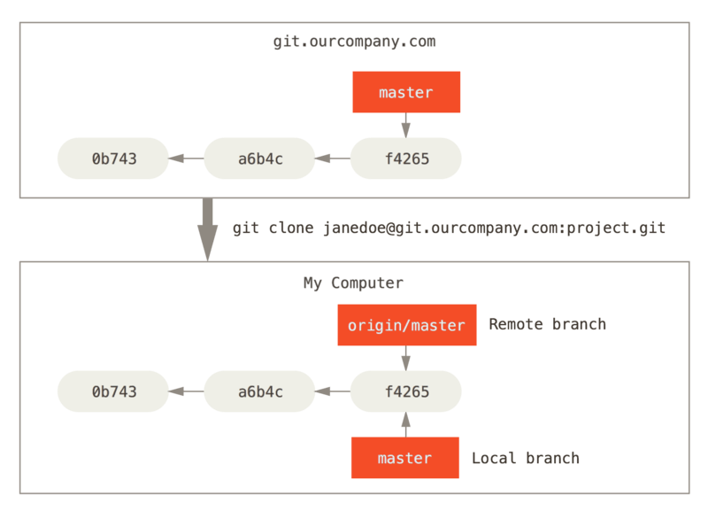

## Branches divergentes

Após algumas alterações locais:

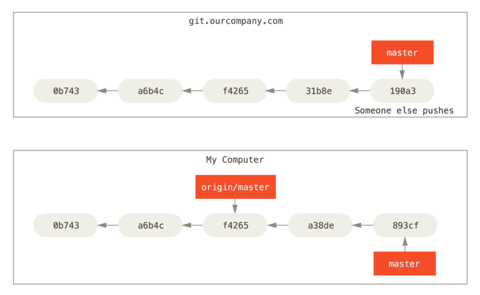

## git fetch

- Alguns colegas realizam alterações em `origin/master`;
- `git fetch origin` baixa as alterações que ainda não temos localmente.

## git fetch

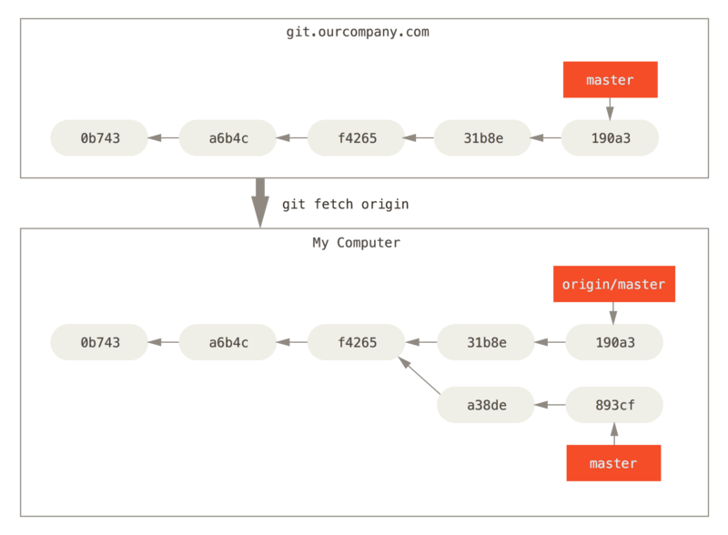

## Mais de um remote

Podemos, ainda, ter mais de um remote cadastrado.

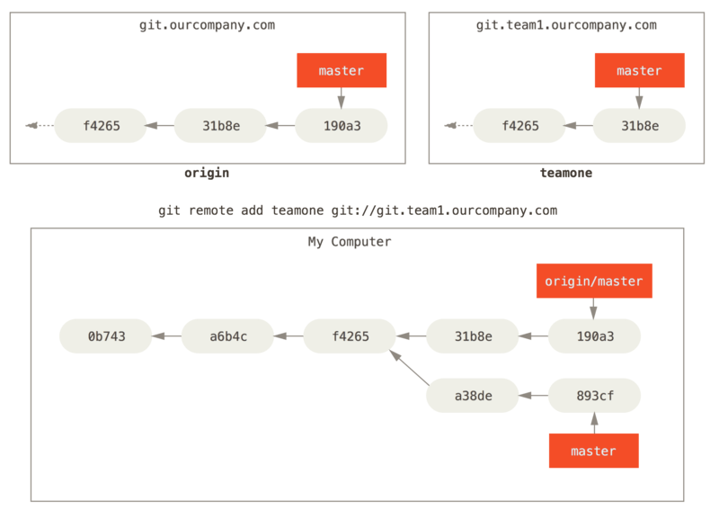

O que acontece com `git fetch teamone` ?

## Resultado

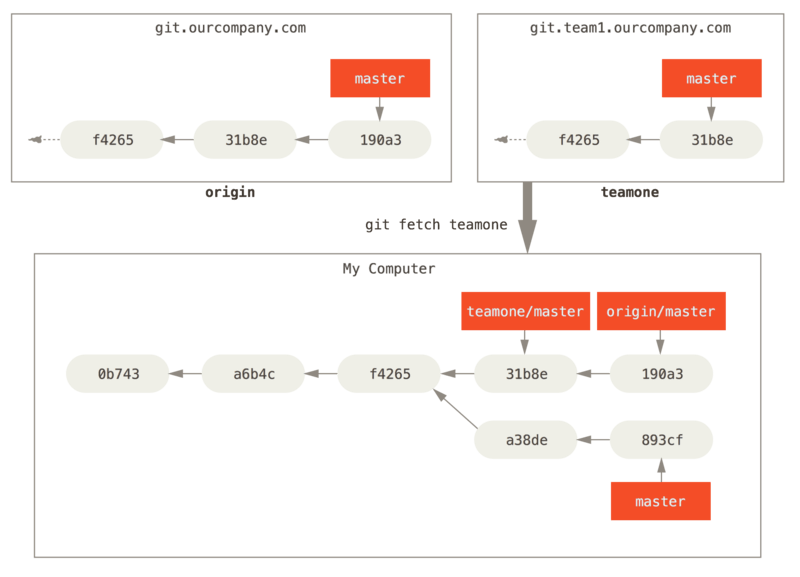

## Pushing branches

- Para compartilhar seu branch local (ou alterações em um branch remoto), é necessário enviar ao *remote*;
- Branches locais **não** são automaticamente compartilhados com nenhum *remote*.
- Para compartilhar um branch:

```bash
$ git push <remote> <branch>
$ git push origin serverfix       # exemplo
# ou
$ git push origin serverfix:serverfix
# ou
$ git push origin serverfix:awesomebranch
# ou
$ git push  refs/heads/serverfix:refs/heads/serverfix
```

## Recebendo uma nova branch remota

```bash
$ git fetch origin
remote: Counting objects: 7, done.
remote: Compressing objects: 100% (2/2), done.
remote: Total 3 (delta 0), reused 3 (delta 0)
Unpacking objects: 100% (3/3), done.
From https://github.com/schacon/simplegit
 * [new branch]      serverfix    -> origin/serverfix
```

* A branch local não foi criada automaticamente;
* Para acessar os arquivos da branch remota, basta um `git switch <remote-branch>`;
- Ou melhor: `git checkout -b <branch> <remote>/<branch>`

## Tracking branches

- Quando acessamos localmente um *branch* remota, como no slide anterior, o git automaticamente cria uma *tracking branch*;
- Ou seja, ele saberá que essa branch local tem um relacionamento direto com a branch remota que a deu origem;
- Isso acontece com a branch *main* quando realizamos um `git clone`, por exemplo;
* Podemos, então, executar `git pull` nessa branch local e o git saberá que deve baixar os dados da branch remota ligada a essa;

## Tracking branches (cont.)

* Esse comportamento será automático se:
  - Realizarmos `git switch <branch>` e:
    - A branch não existe localmente.
    - `<branch>` é exatamente o nome de uma branch remota;
  - Assim, a *tracking branch* é criada automaticamente.

## git fetch X git pull

Simples: `git fetch` apenas baixa os dados novos e não altera a sua *working dir*.

`git pull` baixa os dados novos e, imediatamente depois, inicia um processo de merge com sua *working dir*.

## Removendo branches remotas

```bash
$ git push origin --delete serverfix
To https://github.com/schacon/simplegit
 - [deleted]         serverfix
```

# Rebasing

## O que é Rebasing?

- É o processo de reprodução de commits de uma branch em outra;
- Enquanto o *merge* cria um novo commit a partir da combinação de dois ou mais commits diferentes;
- O **rebase** apenas replica commits de modo a parecer que uma das branches nunca existiu.

Confuso, não?

## Merge clássico

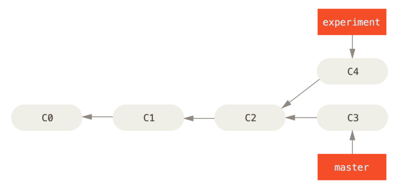

## Merge clássico (cont.)

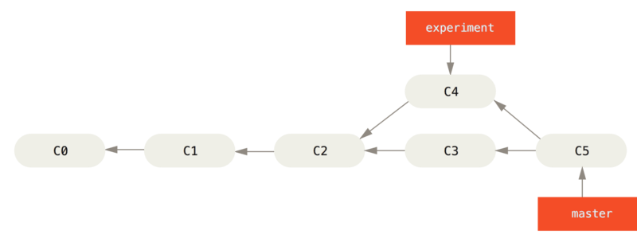

## Resultado com Rebase


## Resultado com Rebase (cont.)

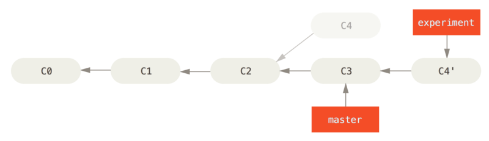

## Após um Fast-forward merge

Após o `rebase`, para que as branches estejam sincronizadas, basta um simples *Fast-forward merge*:

```bash
$ git checkout master
$ git merge experiment
```

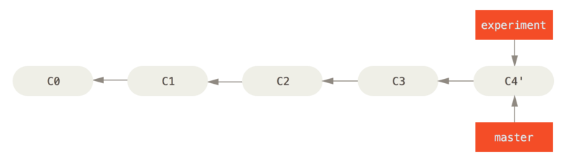

## Comparação de histórico (Merge X Rebase)


## Rebasing mais complexo

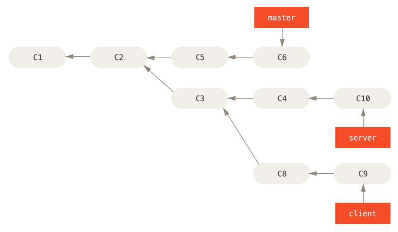

## Rebasing mais complexo (cont.)

O que ocorre após `git rebase --onto master server client`?

"Faça o rebase de client em master, desconsiderando as alterações em server".

## Resultado


## Mais um merge

```bash
$ git checkout master
$ git merge client
```

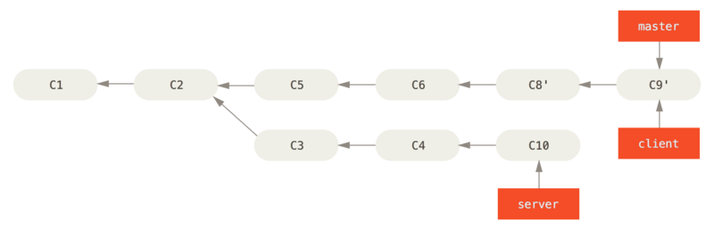

## Mais um rebase

```bash
$ git rebase master server
# ou
$ git switch server
$ git rebase master
```

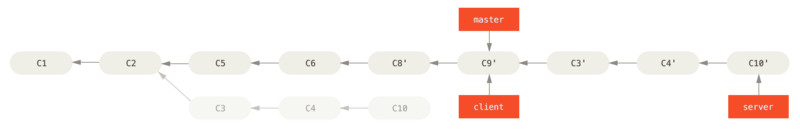

## Finalizando

```bash
$ git checkout master
$ git merge server
$ git branch -d client
$ git branch -d server
```

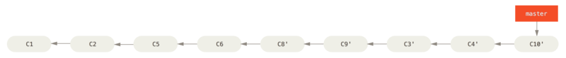

## Perigos de um rebase

- Efetivamente, um *rebase* reescreve a história do desenvolvimento do repositório:
  - Pode ser importante, para manter um histórico [bem organizado](https://simplabs.com/blog/2021/05/26/keeping-a-clean-git-history/);
  - Mas pode ocultar etapas do processo ou, pior ainda, **eliminar commits já referenciados por outras branches**;

Regra para rebase: não faça rebase em commits que existam fora do seu repositório e que outras pessoas possam ter utilizado.

# Git Workflows

## Git Workflows

- O sistema de "*lightweight branching*" do git permite que branches sejam utilizados com frequência no desenvolvimento;
- Assim, possibilita a criação de diferentes **fluxos de desenvolvimento** ou **workflows**.

Um **git workflow** é um conjunto de práticas/regras de branching estipuladas para um projeto.

Existem vários exemplos de *git workflows*. Vamos analisar os mais comuns.

## Git Flow

- Um dos primeiros git workflows propostos, ainda em 2010, por Vincent Driessen (originalmente descrito [aqui](https://nvie.com/posts/a-successful-git-branching-model/)).

- Estabelece um conjunto de regras rígidas de desenvolvimento/branching;

## Git Flow

- Baseia-se nos seguintes tipos de branches:
  - Fixas, ou *long-lived*:
    - Master ou main;
    - Develop;
  - Provisórias, ou *short-lived*:
    - Release;
    - Feature;
    - Hotfix.

## Exemplo Git Flow

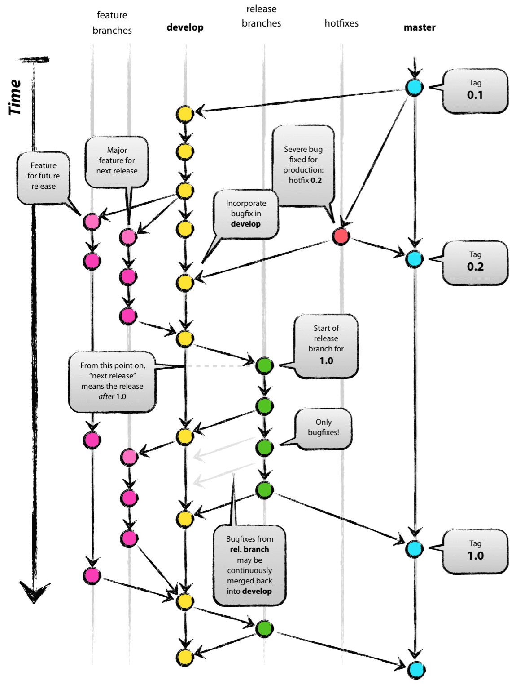{ height=500px }

[Descrição completa](https://nvie.com/posts/a-successful-git-branching-model/)).

## Problemas do Git Flow

- O próprio autor [relata em 2020](https://nvie.com/posts/a-successful-git-branching-model/) que o git flow pode não ser tão apropriado a todos os projetos. Principalmente atualmente;
- Aplicações atuais (não todas) seguem um formato diferente de produção:
  - Entrega contínua;
  - Sem rollbacks (pelo menos não comumente);
  - Sem suporte a versão antigas;
  - Algo parecido com uma aplicação web.

## Problemas do Git Flow

- Em geral, o git flow acaba adicionando:
  - Burocracia ao processo de desenvolvimento;
  - Curva de aprendizagem alta;
  - Incorpora uma grande chance de erro durante o manuseio do repositório.

- Para aplicações com um versionamento explícito, com suporte a versões múltiplas, o git flow ainda pode ser uma boa opção.

## Outros workflows

- Vários outros workflows foram e são propostos;
- Por exemplo, empresas como [GitHub](https://docs.github.com/en/get-started/quickstart/github-flow) e [Gitlab](https://docs.gitlab.com/ee/topics/gitlab_flow.html) tem seus próprios workflows descritos;
- Especificamente, o **Github Flow** descreve um fluxo simplificado, parecido com o **[Trunk Based Development](https://trunkbaseddevelopment.com/)**.

## Trunk Based Development (TBD)

- É um git workflow que busca simplicidade;
- O desenvolvimento é baseado em uma única branch principal, chamada de **Trunk** (a main, no git);
- Todos os integrantes da equipe interagem diretamente nessa branch:
  - Em geral, com **feature branches** curtas que retornam como merge para a Trunk através de operações como o pull request;
  - Para que merges sejam aceitos, as branches precisam passar por testes de pré-integração (precisam gerar um build corretamente).

## Exemplo TBD

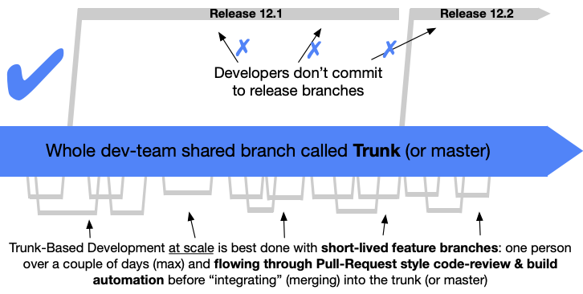

## Pull Request (ou Merge Request)

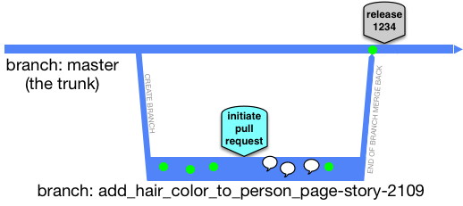

Ferramentas como Github e Gitlab fornecem um esquema completo de submissão, revisão, teste e merge de *Pull requests*.

# Introdução ao Gitlab CI/CD

## Gitlab Pipeline

- A plataforma Gitlab fornece um conjunto de ferramentas completo para a implementação de DevOps baseado em repositórios Git.
- Uma das ferramentas mais importantes é o [**Gitlab Pipeline**](https://docs.gitlab.com/ee/ci/pipelines/);
- Possibilita a criação de pequenas tasks a serem realizadas automaticamente após **pushs** ao repositório:
  - As ações são completamente configuráveis;
- Permite, portanto, a implementação de CI/CD.

## Gitlab Pages

- Uma das tasks mais simples que o Gitlab Pipeline pode rodar é o **Gitlab Pages**;
- Este permite a hospedagem de aplicações estáticas web a partir de repositórios git;
- Utilizaremos esse serviço para um teste preliminar do Gitlab Pipeline e para a prática de workflows.

## Montando um Gitlab Pages simples

1) Crie uma conta no Gitlab; :)
2) Para facilitar, apenas faça um fork do seguinte repositório:
   - https://gitlab.com/das-alexkutzke/pages-example
3) Clone o seu novo fork, realize alguma alteração e, então, faça o push.
4) Seu site deverá estar disponível em instantes em um domínio similar ao seguinte: https://<seu usuário>.gitlab.io/pages-example/

## Como funciona ?

- O repositório possui um arquivo chamado `.gitlab-ci.yml`;
- Este arquivo descreve, segundo um conjunto de regras, o pipeline do projeto:
  - Nele, uma sequência **jobs** são descritos;

## Requisitos

* Para o Gitlab Pages, precisamos:
  - De um job que se chame Pages;
  - Um **artefato** com uma pasta chamada **public**;
  - Os arquivos da aplicação deve ser colocadas na pasta **public**.

- No menu [CI/CD -> Pipelines] pode-se ver o status do pipeline;
- Em [Settings->Pages] encontra-se a URL final da aplicação.

## Próximos passos

Até o final da disciplina utilizaremos o Gitlab Pipeline para a criação de um CI/CD mais completo.

Mas antes, precisamos saber um pouco mais de **Docker**. :)
 
# Referências

## Referências

CHACON, Scott & STRAUB, Ben. "Pro Git". 2014. Acessado em fevereiro de 2022.
[https://git-scm.com/book/en/v2](https://git-scm.com/book/en/v2)

DRIESSEN, Vincent. "A successful Git branching model", 2010/2020, Acessado em fevereiro de 2022. 
[https://nvie.com/posts/a-successful-git-branching-model/](https://nvie.com/posts/a-successful-git-branching-model/)

GitHub flow: 
[https://docs.github.com/en/get-started/quickstart/github-flow](https://docs.github.com/en/get-started/quickstart/github-flow)

## Referências

Gitlab flow: 
[https://docs.gitlab.com/ee/topics/gitlab_flow.html](https://docs.gitlab.com/ee/topics/gitlab_flow.html)

HAMMANT, Paul. "Trunk Based Development". 2020. Acessado em fevereiro de 2022.
[https://trunkbaseddevelopment.com/](https://trunkbaseddevelopment.com/)

WIGGINGS, Adam. "The twelve factor app", 2017. Acessado em fevereiro de 2022.
[https://12factor.net/](https://12factor.net/)
